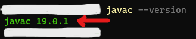
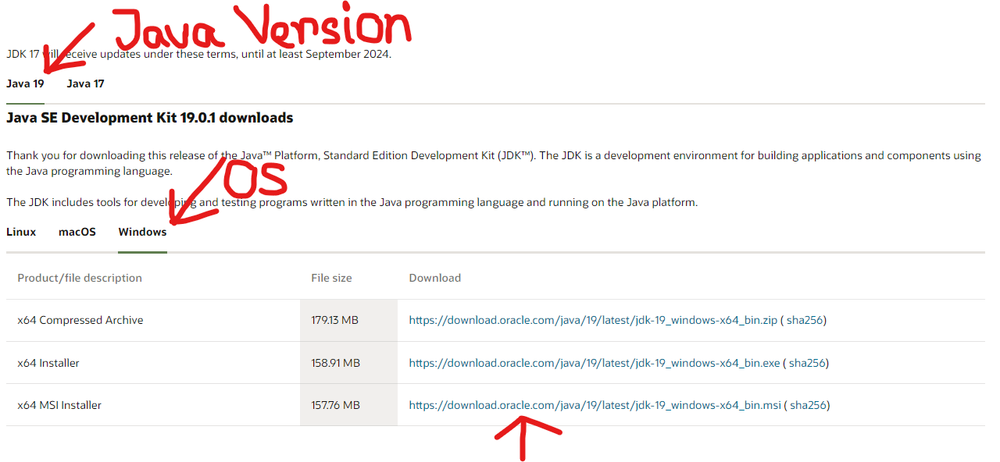
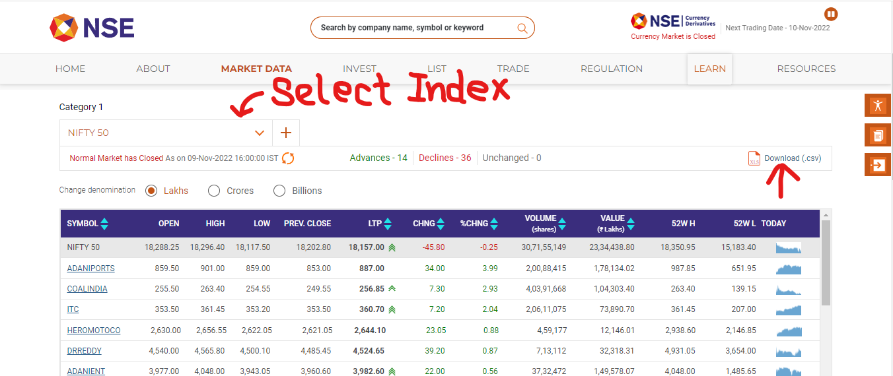
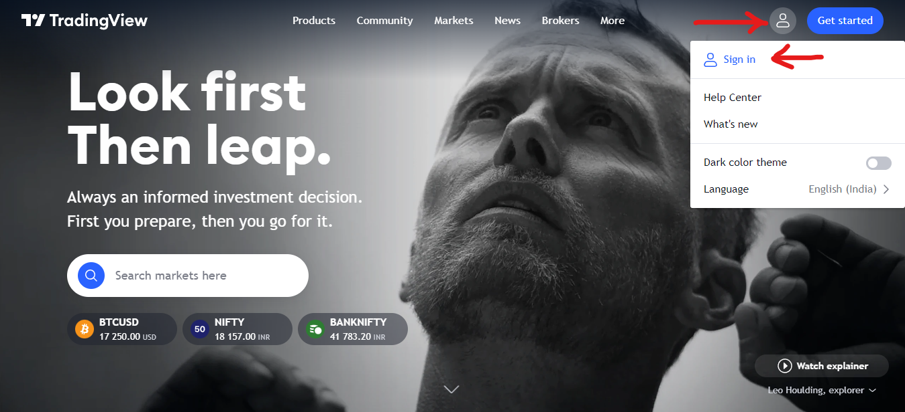
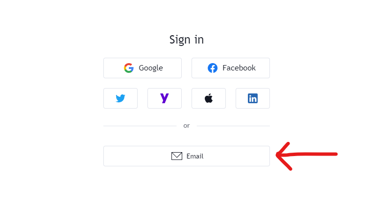
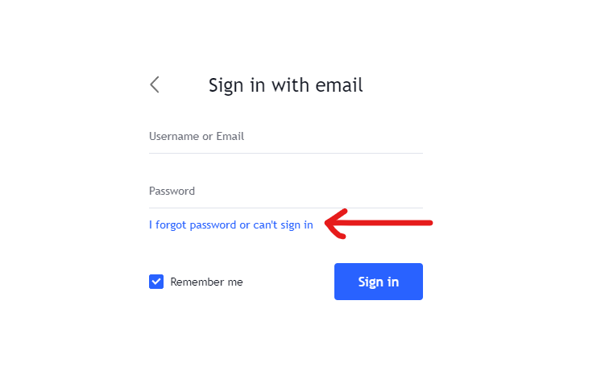
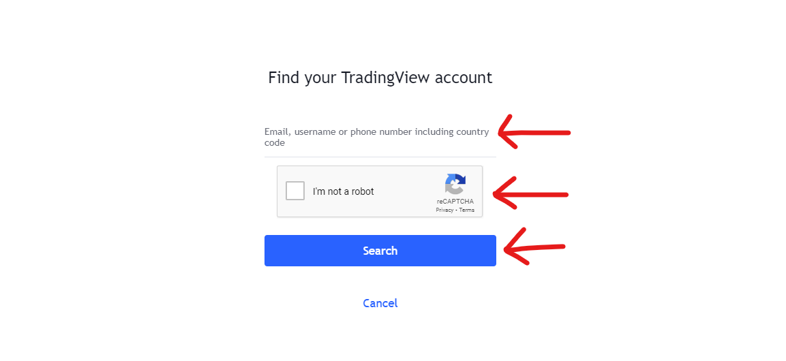
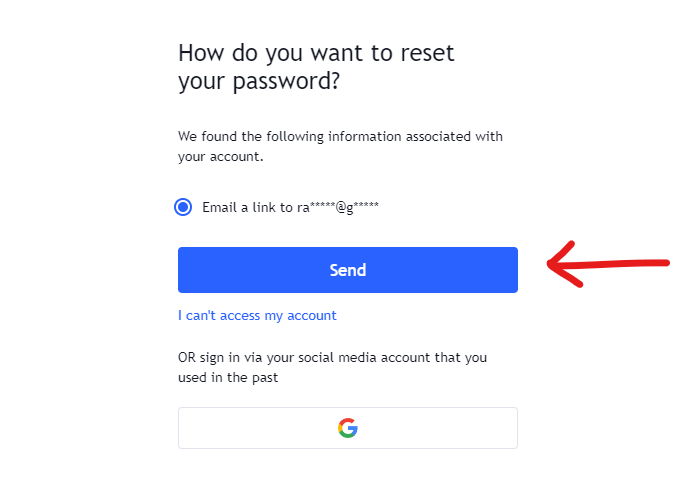

# TradingView WatchList Updater

An easy-to-use Java Application (.jar), which you can
use to update your TradingView watchlist with the stocks
underlying any NSE Index.
<hr>

## Author

- [Rajesh Sinha](https://github.com/rajeshsinha1997)
<hr>

## Pre-Requisites

- ### Java:
  This is a Java application, so to run the application
  Java should be present on your machine.

  NOT SURE HOW TO CHECK IT?

  Open Command-Prompt or Terminal (Based on the
  Operating System present on your machine), and
  type the below command on the Command-Prompt or
  Terminal window, and press enter.

  ```shell
  javac --version
  ```

  Once you press enter, if you see something similar
  as shown below then java is present on your machine.
  You should get a single line as output showing the
  version of the java compiler (i.e. javac).

  ```shell
  javac 19.0.1
  ```
  
  
  If you see any other output apart from what is shown
  above, please click on this link to [Download Java](https://www.oracle.com/in/java/technologies/downloads/)
  for your machine. Once you click on the link,
  select your operating system and then download the
  Java installer. 
  
    

  Once the installer has been downloaded,
  install java on your machine, and try to check if it
  is installed correctly using the same process shown above.
  <hr>
- ### CSV File from NSE Website

  Once you have decided which NSE Index you are going to
  use to get the stocks from, please click on this link to
  [NSE Website](https://www.nseindia.com/market-data/live-equity-market),
  and select the name of the index from the dropdown given
  in the left-hand side.

  

  Once you have selected the index from the dropdown,
  click on the download button present on the right-hand
  side to download the 'csv' file of that index, which
  contains the symbols of the stocks underlying that
  particular index.

  Once the 'csv' file has been downloaded, keep it
  somewhere on your machine handy, as we are going to
  use this file later.
  <hr>
- ### Credentials of TradingView Account

  In order to update any watchlist of your TradingView
  account, the application needs to get access to
  your TradingView account, in order to get access of your
  TradingView account you need to provide the credentials
  (email ID and password) at some point to the application.

  Please keep those credentials accessible to you as
  you will need to provide those details at a later stage
  to the application to sign in to your TradingView
  account.

  Also, if you sign in to your TradingView account using
  Google and don't have any password associated with your
  TradingView account, the kindly follow the below steps
  to generate a password for your account. The application
  will not be able to work without a password.
  <hr>
  
  * Open [TradingView](https://in.tradingview.com/)
  
  
  * Click on Sign In
  

  * Click on Sign In with Email
  

  * Click on Forgot Password
  

  * Provide your email, Validate Captcha and Click on Search
  

  * Click on Send
  

  You will receive an e-mail (the same e-mail ID you provided)
  containing a link to reset the password for your TradingView account.
  Click on the link and set a new password for your TradingView account.

  Note down this password and the email ID, which will be required 
  at a later stage.
  <hr>
  
  **DON'T WORRY WITH SHARING THE CREDENTIALS WITH THE
  APPLICATION, AS THE APPLICATION IS NOT GOING TO STORE
  OR EXPOSE YOUR CREDENTIALS IN ANY WAY. HOWEVER, IF YOU WANT
  TO BE EXTRA SECURE, PLEASE CHANGE THE PASSWORD ASSOCIATED
  WITH YOUR TRADINGVIEW ACCOUNT AFTER THE OPERATION.**


## Usage/Examples


